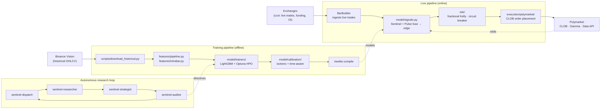

# QM — Quant ML for Polymarket Crypto Binaries

ML pipeline that trades crypto-binary prediction markets on
[Polymarket](https://polymarket.com). Two complementary LightGBM models —
**Sentinel** (predicts the next bar from completed bars) and **Pulse**
(predicts the current bar from a t=0.80 snapshot) — produce calibrated
probabilities for 12 independent markets in parallel (BTC / ETH / SOL / XRP
× 5m / 15m / 1h). Edge against live Polymarket odds is sized via fractional
Kelly with per-asset correlation limits and a daily-loss kill switch.

Wrapped around the model layer is a **multi-agent autonomous research loop**
that designs experiments, runs HPO, audits results, and updates configs
without supervision — driving 150+ research iterations to HPO exhaustion
across all 12 models.

---

## Why this repo is interesting

- **Twelve calibrated models in production, end-to-end.** 1.9 M bars
  (2022-2026, Binance Vision futures USDT-M) → 37 Sentinel features + 23
  Pulse features → LightGBM + Optuna HPO → isotonic + time-aware calibration
  → treelite-compiled inference. All under walk-forward CPCV with PBO
  (probability of backtest overfit) and Deflated Sharpe as the keep gate.

- **Sentinel + Pulse fusion**: Sentinel is the "what's the next bar going to
  do?" model trained on completed-bar features; Pulse is the "the current bar
  is 80% done, what's the close going to look like?" model trained against
  intra-bar OHLC path simulations. They fuse at the signal layer because
  Polymarket's 5m / 15m / 1h contracts resolve at the next bar close — both
  models matter, but at different points within a single window.

- **Honest validation.** Walk-forward with purge + embargo, CPCV with PBO
  threshold < 0.40, Deflated Sharpe > 0, OOS Brier < 0.25, OOS Expected
  Calibration Error < 0.05. Acceptance criteria are tracked in
  [`ARCHITECTURE.md`](ARCHITECTURE.md) and enforced before any model goes live.

- **Multi-agent autonomous research loop.** Seven specialized agents
  (`sentinel-dispatch`, `sentinel-researcher`, `sentinel-strategist`,
  `sentinel-auditor`, `sentinel-analyst`, `sentinel-builder`,
  `sentinel-reconciler`) plus a parallel `dutch-*` loop. State is flat files
  in `autoresearch/` (`knobs.json`, `results.tsv`, `strategy.md`, `audit.md`,
  `phase.json`) — no message bus, no shared process, deliberately
  crash-resistant and auditable. 150+ iterations until structural floors
  confirmed across all 12 models.

- **Production live trading.** Multi-asset (ETH + SOL + XRP at 5m, $2/order)
  with daily-loss kill switch, `MIN_ORDER_USD` enforcement, paper-vs-live
  reconciliation cycle that auto-opens fixes when divergence is real.

- **Polyglot with Rust fast path.** Python for everything outside the
  hot path; `crates/qm-fast/` Rust crate planned for sub-millisecond
  live inference once execution latency becomes the binding constraint.

---

## Architecture



### Tech stack

- **Language**: Python 3.11+ (cross-platform — Windows dev + Ubuntu prod)
- **Data**: Polars, DuckDB, Hive-partitioned Parquet, TimescaleDB (with Alembic migrations)
- **ML**: LightGBM, Optuna, scikit-learn, treelite (compiled inference), optional PyTorch / TabNet via the `gpu` extra
- **Calibration**: scipy (isotonic regression)
- **Validation**: Walk-forward, purge + embargo, CPCV with PBO, Deflated Sharpe
- **Risk**: Fractional Kelly, correlation limits, daily-loss circuit breaker
- **Execution**: py-clob-client, web3 + eth-account (manual EIP-712 signing)
- **Config**: Hydra + OmegaConf
- **Secrets**: keyring with env / `.env` fallback (`src/qm/core/secrets.py`)
- **Scheduling**: APScheduler
- **Observability**: structlog (secret-redacted), Prometheus
- **Quality**: ruff (7 lint categories), mypy strict, pytest with unit / integration / benchmark splits, pre-commit hooks
- **Rust fast path**: `crates/qm-fast/` (planned, not yet wired) targeting <1.5ms inference

---

## Repository map

```
.
├── src/qm/                       Main Python package
│   ├── core/                     Domain types, secret loader, config
│   ├── data/                     Ingestion, OHLCV reconciliation, TimescaleDB I/O
│   ├── features/                 Polars-based feature pipeline (Sentinel + Pulse)
│   ├── model/
│   │   ├── trainers/             LightGBM + Optuna HPO, Pulse walk-forward
│   │   ├── targets/              Intra-bar target generation
│   │   ├── calibration/          Isotonic + time-aware bucket calibration
│   │   └── signals.py            Sentinel + Pulse fusion + edge calculation
│   ├── backtest/                 Dual-mode (vectorized + event-driven) backtest engine
│   ├── strategy/dutch/           Dutch accumulation strategy (bilateral limit orders)
│   ├── execution/polymarket/     CLOB client, EIP-712 signing, relayer integration
│   ├── risk/                     Fractional Kelly, correlation, circuit breaker
│   ├── scheduler/                APScheduler-based cron
│   ├── monitoring/               Prometheus metrics, structured logging
│   └── cli/                      `qm` CLI entry point
│
├── crates/qm-fast/               Rust fast-path crate (planned)
├── conf/                         Hydra configs
├── scripts/                      Training / analysis / live entry-points
├── tests/                        unit / integration / benchmark
├── autoresearch/                 Autonomous research loop state + outputs
├── .claude/agents/               Multi-agent definitions (sentinel-*, dutch-*)
├── docs/                         Extended design docs (PULSE_MODEL_PLAN, etc.)
├── deploy/                       systemd service definition
├── .docker/                      Production Dockerfile + docker-compose
├── .github/workflows/            CI (test + build-live)
├── PLAN.md                       Implementation plan / scratchpad
└── ARCHITECTURE.md               Deeper architecture write-up
```

---

## Getting Started

> Personal research / production system, not a turn-key product. The default
> safe path is **paper mode** — no real CLOB orders are placed; the system
> runs end-to-end against live Polymarket odds but every fill is simulated.
> Do not flip to live trading without auditing the risk + filter chain
> against your own risk tolerance.

**Prerequisites:** Python 3.11+, [`uv`](https://docs.astral.sh/uv/) (recommended) or pip,
Docker (for TimescaleDB), Rust 1.85+ (only if building `qm-fast`).

### Quickstart

```bash
# 1. Clone + install
git clone https://github.com/mantotan/quant-modelling.git
cd quant-modelling
uv sync                          # or: pip install -e .[dev]

# 2. Verify the codebase compiles + tests pass
uv run pytest tests/unit -v

# 3. Optional: bring up TimescaleDB + Prometheus + Grafana (for live-mode telemetry)
docker compose up -d

# 4. Env — paper-mode is the default; you only need credentials for live trading
cp .env.example .env
$EDITOR .env                     # set TIMESCALEDB_URL=postgresql://qm:qm@localhost:5432/qm

# 5. Download a slice of historical OHLCV (full corpus is ~1.9M bars; this fetches one)
uv run python scripts/download_historical.py --asset BTC --timeframe 5m --since 2025-01-01

# 6. Train one model (n-trials reduced for fast iteration; default is 50)
uv run python scripts/train_sentinel.py --asset BTC --timeframe 5m --n-trials 5

# 7. Run the paper-mode monitor against live Polymarket odds
uv run python scripts/monitor_pulse.py --asset BTC
```

### Verifying it's running

```bash
uv run pytest tests/unit -v                   # all unit tests pass
ls data/models/sentinel/BTC_5m/               # model artifacts emitted after step 6
docker compose ps                             # timescaledb / prometheus / grafana up
uv run python scripts/monitor_pulse.py --asset BTC --no-polymarket
                                              # smoke test using simulated odds (no external connection)
```

### Going live

Requires a funded Polymarket wallet and CLOB API credentials. Update `.env`:

```
POLYMARKET_PRIVATE_KEY=0x...
POLYMARKET_API_KEY=...
POLYMARKET_API_SECRET=...
POLYMARKET_PASSPHRASE=...
POLYMARKET_FUNDER_ADDRESS=0x...
POLYMARKET_SIGNATURE_TYPE=1                   # 0=EOA, 1=POLY_PROXY, 2=GNOSIS_SAFE
POLYGON_RPC_URL=https://polygon-mainnet.g.alchemy.com/v2/YOUR_KEY
```

Then:

```bash
uv run python scripts/trade.py --mode live --asset BTC --bankroll 5000
```

For the production deploy path (Docker, GHCR, systemd) see `.docker/docker-compose.live.yml`
and `deploy/trade.service`.

### Common commands

| Command | Purpose |
|---|---|
| `uv run pytest tests/unit -v`                              | Unit tests |
| `uv run pytest tests/integration -v`                       | Integration tests (needs TimescaleDB) |
| `uv run pytest tests/benchmark --benchmark-only`           | Benchmark suite |
| `uv run ruff check`                                        | Lint |
| `uv run mypy src/`                                         | Strict type check |
| `uv run python scripts/train_sentinel.py --asset BTC --timeframe 5m` | Train one Sentinel model (full HPO; add `--n-trials 5` for fast iteration) |
| `uv run python scripts/train_pulse.py --asset BTC --timeframe 5m`    | Train one Pulse model |
| `uv run python scripts/monitor_pulse.py --asset BTC`                 | Live paper monitor against Polymarket (paper is default) |
| `uv run python scripts/monitor_pulse.py --asset BTC --no-polymarket` | Same monitor with simulated odds (offline smoke test) |
| `uv run python scripts/trade.py --mode paper --asset BTC --bankroll 5000` | Paper trading loop |

---

## Tests

- **Python:** unit + integration + benchmark suites under `tests/` (~67 test files,
  227 + tests passing). Strict mypy + ruff in CI.
- **CI gate:** every push runs `pytest tests/unit` then builds + pushes the
  Docker image to GHCR. See `.github/workflows/`.

---

## Status

Active research + production system, public for portfolio / reference
purposes. Not packaged as a library, not maintained for external users, no
support promised. **Trading is risky; this code can lose money. Read the
[LICENSE](LICENSE) before using.**

---

## License

[MIT](LICENSE).
